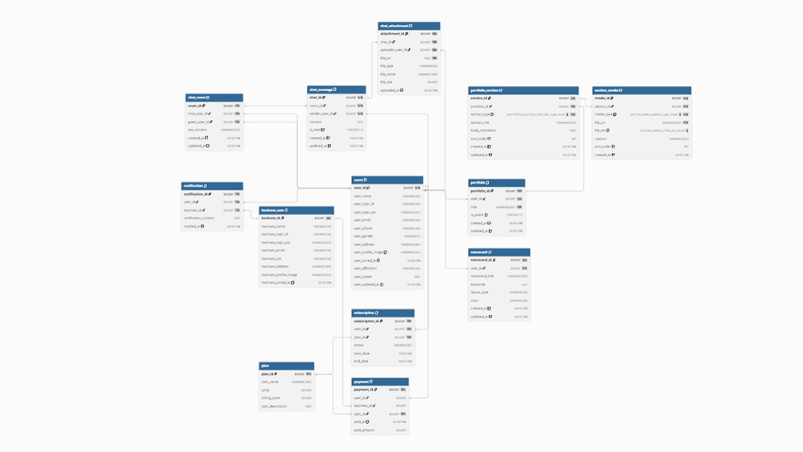
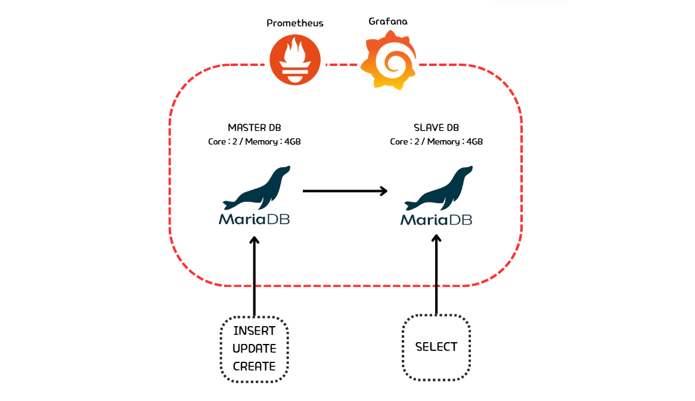

# 🪪 PortiCard

 

 

## 👥 팀원 소개

<!-- 원하는 사진 주소 복사해서 링크 수정해주시면 됩니다 -->

|  |  |  |  |
| :----------------------------------------------------------------------------------------: | :-----------------------------------------------------------------------------------------: | :-------------------------------------------------------------------------------------------------------------------: | :-------------------------------------------------------------------------------------------------------------------: |
|                              🍀 **오은서** [@katie130300-netizen](https://github.com/katie130300-netizen)                              |                  🍀 **이성재** [@Tahcy-99](https://github.com/Tahcy-99)                 |                    🍀 **전성훈** [@1jshun](https://github.com/1jshun)                   |                               🍀 **최승우** [@sw-oo](https://github.com/sw-oo)                               |                        

 

## 📘 프로젝트 소개

**PortiCard** 서비스는 사용자의 경력 및 업력을 분석하여 **구직·이직용 포트폴리오 작성을 지원**하고, 핵심 키워드를 포함한 **디지털 명함을 생성·관리하는 웹 서비스**입니다.

사용자는 자신의 경험과 프로젝트 내용을 포트폴리오로 작성할 수 있으며, 시스템은 이를 분석하여 주요 기술 스택과 역량을 자동으로 도출합니다. 이를 통해 사용자는 자신의 전문성을 보다 명확하게 정리하고, 효율적인 자기 표현 수단으로 활용할 수 있습니다.

또한 기업은 본 서비스를 통해 구직자의 디지털 명함과 포트폴리오를 확인함으로써 **지원자의 핵심 역량을 신속하게 파악**하고, 이를 기반으로 **채용 및 인재 컨택 과정에 활용**할 수 있습니다.

 

## 🛠️ 기술 스택

### DBMS

### Monitoring

### Version Cntrol & Collaboration

 

## 📆 프로젝트 기획안
[프로젝트 기획안](./docs/프로젝트%20기획안.pdf)

 

## 💡요구사항 정의서

[요구사항 정의서](./docs/요구사항%20정의서.pdf)

 

## 📝 테이블 명세서

[테이블 명세서](./docs/테이블%20명세서.pdf)

 

## 📊 ERD

 

## 📌 시스템 아키텍처

 

## ⚠️ 재해 복구 (DR)

 Master-Slave Replication 방식 사용 
  

🔍 **리소스 최적화 및 인프라 확장 전략**

* 현재 예상되는 동시 접속자 수준에 맞춰 과도한 자원 낭비를 방지하고자, 반복적인 테스트를 통해 서버 코어와 메모리를 최적의 최소 사양으로 조정하였습니다.

* 향후 서비스 규모가 확대되거나 트래픽 증가가 필요한 시점에는, HAProxy를 활용한 Slave 서버 추가 등 인프라 확장을 검토할 예정입니다.

 

🔍 **서비스의 특성 및 핵심 요구사항**
* 포트폴리오 생성·수정, 섹션 편집, 미디어 업로드 등 INSERT/UPDATE 작업이 서비스의 주를 이룹니다.

* 사용자 입력에 대한 즉각적인 저장과 응답이 중요하며, 트랜잭션 지연은 사용자 경험에 직결됩니다.

 

🔍 **기술 비교 및 분석**

* 여러 노드 간 합의 과정을 거쳐 데이터를 저장하므로 쓰기 시점마다 동기화 비용이 발생하며, 이는 쓰기 속도 지연으로 이어집니다.

* Master에 데이터를 먼저 저장한 뒤 Slave로 비동기 복제하는 방식이므로 쓰기 요청에 대한 빠른 응답 속도를 유지할 수 있습니다.

 

🔍 **Master-Slave 레플리케이션 채택 이유**

* 쓰기 작업은 Master DB에서 단일 처리하여 데이터 정합성을 유지하고 빠른 저장 속도를 보장합니다.

* 읽기 작업(SELECT)은 Slave DB로 분산하여 시스템 전체의 조회 부하를 줄이고 확장성을 확보합니다.

* 이를 통해 쓰기 성능 저하 없이 포트폴리오 작성 기능을 제공하며, 다수의 사용자 조회 요청에도 유연하게 대응합니다.

 

 장애 복구 시나리오 
  

🔍 **Master DB 장애 발생 시 (Write 불가 상황)**
* Prometheus가 Master DB의 메트릭 중단 혹은 연결 실패를 감지하고 Grafana 대시보드 및 알람을 통해 장애 상황을 전파합니다.

* Slave DB에 쓰기 권한 부여 후 새로운 Master로 승격하여 쓰기 서비스 가용성을 확보합니다.

* Slave로 복제되지 않은 일부 데이터가 있는지 확인 후 필요시 Binary Log를 활용해 복구를 수행합니다.

 

🔍 **Slave DB 장애 발생 시 (Read 부하 가중 상황)**
* Prometheus 알람을 통해 Slave DB의 다운타임을 즉각적으로 인지합니다.

* 읽기요청을 일시적으로 Master DB가 모두 부담하도록 설정하여 조회 서비스 중단을 방지합니다.

* 장애가 발생한 Slave DB를 재시작하고, Master로부터 중단된 시점 이후의 데이터를 다시 복제하여 최신화합니다.

 

🔍 **장애 예방 및 상시 관리**
* Prometheus와 Grafana를 활용해 CPU, Memory 사용량 및 Replication Lag를 상시 감시하여 임계치 초과 시 선제적으로 대응합니다.

* Master와 Slave 모두 동일한 스펙(Core 2 / Memory 4GB)으로 구성하여, 장애 시 역할 전환 후에도 성능 저하 없는 서비스를 제공합니다.

 

## 🧾 부하테스트 결과

### select 문

  
포트폴리오에 포함된 파일 불러오기

  
  

  
포트폴리오 내용 불러오기

  

  
채팅방 목록 가져오기

  

  
특정 채팅방 채팅 목록 가져오기

  

### INSERT 문

  
회원가입

  

  
포트폴리오 작성

  
  

  
채팅방에 메시지 전송

  

<!--

##부하 테스트 결과

## 재해 복구

## SQL

#### 🔻 DDL
[DDL SQL 파일](/sql/DDL.sql)

#### 🔻 DML
[DML SQL 파일](/sql/DML.sql)

 

  
<b>회원</b>

  

   

  ▪️ 닉네임 중복확인 
  
  
   
   
  

 

  
<b>레시피 조회</b>

  

   

  ▪️ 좋아요 많은 순으로 정렬  
  

   

  ▪️ 최신순으로 정렬 
  
  
   
  

 

## 📘 SQL 튜닝

-->
