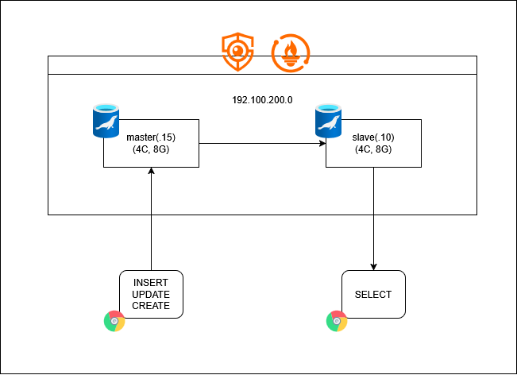

# 🪪 PortiCard

 

 

## 👥 팀원 소개

🍀 **오은서** | 🍀 **이성재** | 🍀**전성훈** | 🍀 **최승우**                            

 

## 📘 프로젝트 소개

**PortiCard** 서비스는 사용자의 경력 및 업력을 분석하여 **구직·이직용 포트폴리오 작성을 지원**하고, 핵심 키워드를 포함한 **디지털 명함을 생성·관리하는 웹 서비스**입니다.

사용자는 자신의 경험과 프로젝트 내용을 포트폴리오로 작성할 수 있으며, 시스템은 이를 분석하여 주요 기술 스택과 역량을 자동으로 도출합니다. 이를 통해 사용자는 자신의 전문성을 보다 명확하게 정리하고, 효율적인 자기 표현 수단으로 활용할 수 있습니다.

또한 기업은 본 서비스를 통해 구직자의 디지털 명함과 포트폴리오를 확인함으로써 **지원자의 핵심 역량을 신속하게 파악**하고, 이를 기반으로 **채용 및 인재 컨택 과정에 활용**할 수 있습니다.

 

## 프로젝트 기획안
[프로젝트 기획안](https://docs.google.com/document/d/1uJZFsL8RkwhV966r5V3YNvqtKCgFLajqJqTCdzTZBmg/edit?tab=t.0)

 

## 요구사항 정의서

[요구사항 정의서](https://docs.google.com/spreadsheets/d/19QDROSkjR6Pb0Gci8nnkqwB4oXsROOQEx7DVDcdNbCg/edit?gid=706060403#gid=706060403)

 

## ERD

## 시스템 아키텍쳐

본 서비스는 포트폴리오 생성·수정, 섹션 편집, 미디어 업로드 등 **쓰기(INSERT/UPDATE) 작업**이 빈번하게 발생하는 서비스입니다. 이러한 쓰기 작업은 사용자 입력에 대한 즉각적인 저장과 빠른 응답 속도가 중요하며, 트랜잭션 처리 지연은 사용자 경험에 직접적인 영향을 주게 됩니다.

클러스터 구조는 여러 노드 간 합의를 통해 데이터를 저장하므로 쓰기 시점마다 동기화 비용이 발생하고, 이는 쓰기 속도의 지연으로 이어집니다. 
반면 Master–Slave 레플리케이션은 Master에 먼저 데이터를 저장한 뒤 Slave로 비동기 복제하는 방식이기 때문에, 쓰기 요청에 대한 응답 속도를 빠르게 유지할 수 있습니다.

따라서 본 시스템에서는

쓰기 작업은 Master DB에서 단일 처리하여 데이터 정합성과 빠른 저장을 보장하고,
읽기 작업은 Slave DB로 분산하여 조회 부하를 줄이고 확장성을 확보하기 위해
**Master–Slave 레플리케이션 구조**를 채택하였습니다.

이 구조를 통해 쓰기 성능 저하 없이 포트폴리오 작성 기능을 안정적으로 제공하면서, 다수의 사용자 조회 요청에도 유연하게 대응할 수 있습니다.

 

## 테스트 결과

### select 문

  
채팅방 목록 가져오기

  

  
특정 채팅방 채팅 목록 가져오기

  

  
알림 목록 선택

  

### INSERT 문

  
회원가입

  

  
포트폴리오 섹션 작성

  
  

  
포트폴리오 작성

  
  

  
채팅방에 메시지 전송

  

 

## 부하테스트 결과

### select 문

  
포트폴리오에 포함된 파일 불러오기

  
  

  
포트폴리오 내용 불러오기

  

  
채팅방 목록 가져오기

  

  
특정 채팅방 채팅 목록 가져오기

  

  
알림 목록 선택

  

### INSERT 문

  
회원가입

  

  
포트폴리오 섹션 작성

  
  

  
포트폴리오 작성

  
  

  
채팅방에 메시지 전송

  

 

## 테스트 결과

<!--

##부하 테스트 결과

## 재해 복구

## SQL

#### 🔻 DDL
[DDL SQL 파일](/sql/DDL.sql)

#### 🔻 DML
[DML SQL 파일](/sql/DML.sql)

 

  
<b>회원</b>

  

   

  ▪️ 닉네임 중복확인 
  
  
   
   
  

 

  
<b>레시피 조회</b>

  

   

  ▪️ 좋아요 많은 순으로 정렬  
  

   

  ▪️ 최신순으로 정렬 
  
  
   
  

 

## 📘 SQL 튜닝

-->
